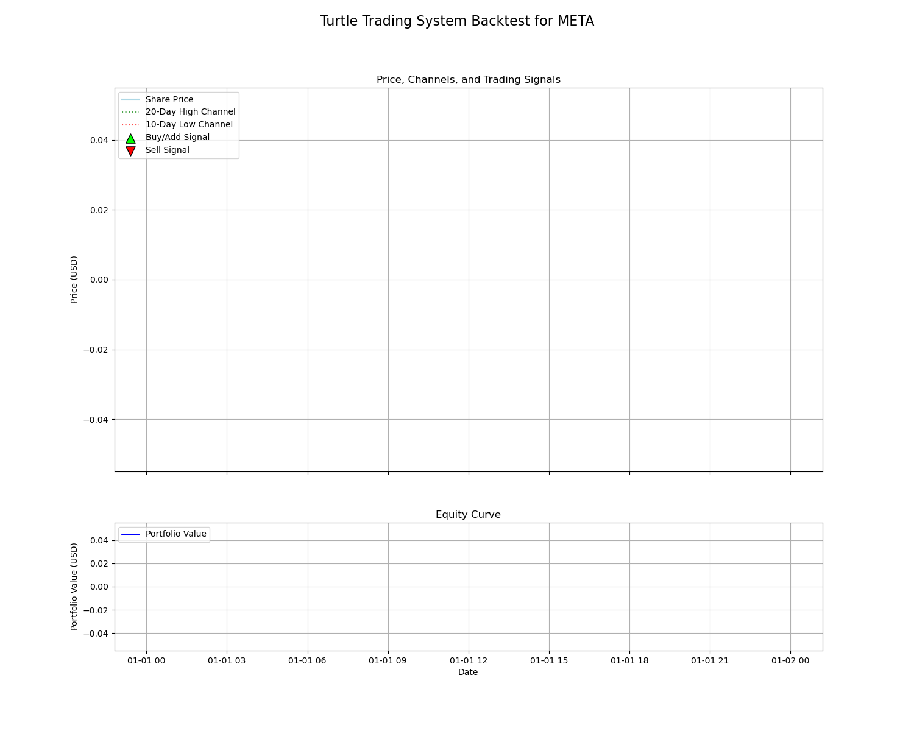

# Turtle Trading System Backtest Engine

This project provides a Python script that backtests the classic trend-following Turtle Trading strategy, including its core risk and position management rules. It fetches historical stock data, calculates the Average True Range (ATR or 'N'), determines position sizing based on account equity and volatility, and simulates trades based on price breakouts. The results, including the equity curve, are visualized using Matplotlib.

## Sample Output

The script will generate and save a plot named `turtle_system_backtest.png`. This chart displays the stock's price, the entry/exit channels, the trading signals, and the growth of the portfolio's value over time.



## The Turtle Trading Strategy Explained

This script implements the core principles of the famous Turtle Trading system, which is a complete system that goes beyond simple signals.

### 1. The Core Idea: Trend Following
The strategy aims to capture long-term trends by buying when a stock breaks out to a new high and selling when the trend appears to have reversed.

### 2. Risk Management: The 'N' Value (ATR)
The system's risk is managed using the **Average True Range (ATR)**, which the Turtles called **'N'**. 'N' represents the average daily price volatility of the stock.

### 3. Position Sizing: The 'Unit'
This is the heart of the system. Instead of buying a fixed number of shares, trades are made in 'Units'. The size of one Unit is calculated so that a price movement of 1N would result in a loss of only 1% of the total account equity.

Unit Size (in shares) = (1% of Equity) / N

This ensures that positions are larger during periods of low volatility and smaller during periods of high volatility.

### 4. The Trading Rules
- **Entry (Buy Signal ▲):** A long position of **1 Unit** is opened when the price closes above the high of the last **20 days**.
- **Adding to a Position (Pyramiding ▲):** If the price moves up by **0.5N** from the last entry price, another Unit is added to the position. This can be done up to a maximum of **4 Units**.
- **Exit (Sell Signal ▼):** The entire position is closed when the price closes below the low of the last **10 days**.

## Features

- Implements a full backtest of the Turtle Trading system, not just signal generation.
- Uses the Average True Range (ATR) for dynamic position sizing based on volatility.
- Includes logic for pyramiding (adding to winning positions).
- Visualizes both the trading signals on the price chart and the resulting portfolio equity curve.
- Allows for easy customization of all key strategy parameters.

## Getting Started

Follow these instructions to run the backtest on your local machine.

### Prerequisites

- Python 3.8+

### Installation

1.  **Clone the repository:**
    ```bash
    git clone <your-repository-url>
    cd <your-repository-directory>
    ```

2.  **Create and activate a virtual environment (recommended):**
    ```bash
    # For macOS/Linux
    python3 -m venv venv
    source venv/bin/activate

    # For Windows
    python -m venv venv
    .\venv\Scripts\activate
    ```

3.  **Install the required packages:**
    Create a file named `requirements.txt` and add the following lines:
    ```txt
    pandas
    matplotlib
    yfinance
    numpy
    ```
    Then, run the installation command from your terminal:
    ```bash
    pip install -r requirements.txt
    ```

## Usage

To run the backtest and generate the plot, simply execute the `main.py` script:
```bash
python main.py

The script will save the chart as turtle_system_backtest.png and then display it on your screen.

 
